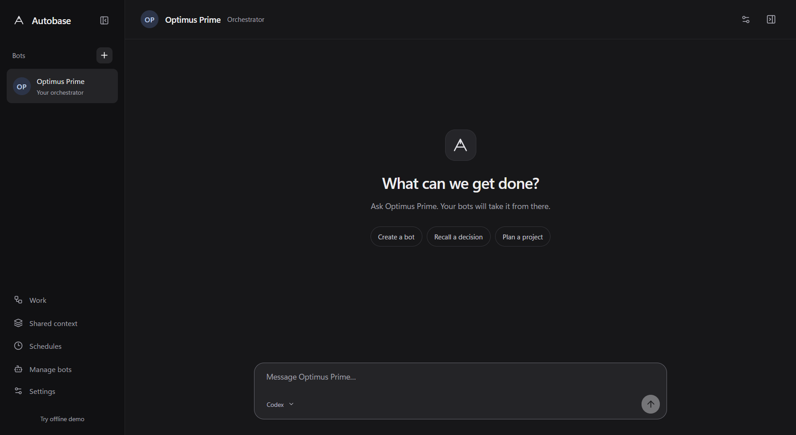

# Autobase

A simple, dark Windows desktop app for getting work done with a team of bots. Talk to **Optimus Prime**, your persistent orchestrator. It creates specialists such as **Bumblebee**, **Wheeljack**, and **Ratchet**, delegates bounded tasks, retrieves shared context, and brings back real results.

The core app is implemented and locally verified. Real Codex chat, conversational bot creation, two-helper delegation, memory retrieval, artifacts, and packaged-app persistence passed live checks. Claude has a real official SDK adapter; its model execution remains API-key blocked. The optional virtual computer milestone is incomplete. See the [verification matrix](docs/verification.md) for live, fixture, and unverified coverage.



## Run the Windows package

Open `release\Autobase-win32-x64\Autobase.exe`. Keep the entire directory together. This is a portable, unsigned local application; no installer or public release was published.

The default screen is Optimus Prime’s conversation. Work details stay closed until requested; files and helper summaries appear inline. Choose **Try offline demo** for deterministic scenarios in a separate database. No simulated response is routed through a live engine.

## Develop and verify

Use Node **24.20.0**. The preparation machine's global Node 20.17.0 is retained. Install a project-local runtime, then invoke npm through it:

```powershell
npm install --prefix .tooling --no-audit --no-fund node@24.20.0
.\scripts\run.ps1 ci --include=optional
.\scripts\run.ps1 run dev
```

`dev` builds and launches Electron. Restart after source edits; hot reload is not implemented. `.\scripts\run.ps1 start` opens an existing build.

```powershell
.\scripts\run.ps1 run verify
.\scripts\run.ps1 run package
.\scripts\run.ps1 run test:packaged
```

`verify` runs TypeScript, domain/adapter/runtime tests, a production build, and Electron tests. **`test:packaged` makes one bounded live Codex request through existing native login.** It requires the package and ready Codex authentication. Tests use isolated `.cache` directories.

Additional deliberately live checks:

```powershell
.\scripts\run.ps1 run test:live
.\scripts\run.ps1 run test:live:delegation
.\.tooling\node_modules\node\bin\node.exe node_modules/tsx/dist/cli.mjs scripts/web-smoke.ts
```

Run `test:live` before `test:live:delegation`; the latter uses the persistent Evidence Clerk created by the first. Live checks use `gpt-6-astra` with `xhigh`. In-app model choice remains editable and defaults to the provider's discovered default.

## Engines and access

- **Codex:** CLI **0.153.4**, pinned experimental App Server/dynamic tools. Run `codex login` with supported native ChatGPT authentication. Autobase does not copy tokens or use ambient paid OpenAI API keys. Models come from the provider catalog. `RELAY_CODEX_PATH` can identify a native `codex.exe` if automatic discovery fails.
- **Claude Agent:** official SDK **0.3.266**, including its native runtime. Enter an Anthropic API key in Settings and an explicit supported model ID in bot configuration. API billing applies. Keys use Windows DPAPI; claude.ai subscription login is not offered. No live Claude model call was made in this build.
- **Tools:** shared context, selected-folder text reads, public HTTPS text retrieval, bot/task operations, exact-action decisions, schedules, and managed artifacts. Shell commands and host desktop control are not exposed.

Selecting a project folder grants read access to the orchestrator. Web reads require an exact one-time approval unless the owner grants that bot public-web scope. Child permissions cannot exceed the parent's. Provider-reported usage is displayed where available; unavailable cost is labelled explicitly.

## Data and availability

The Autobase rename retains the existing data directory, normally `%APPDATA%\Relay` on Windows. The original default bot is renamed to Optimus Prime once; custom names and past run snapshots are preserved. Personal and Demo have separate SQLite databases and artifact directories. Bots, conversations, run attempts, decisions, and schedules survive restart.

Closing Autobase exits its runtime. Active work becomes interrupted and requires inspection before retry; uncertain side effects are not replayed. Schedules require Autobase and the computer to be available. Missed occurrences coalesce into at most one catch-up per schedule and do not overlap existing work.

## Handoff

- [Architecture and material choices](docs/architecture.md)
- [Verification, commands, evidence, and concrete blockers](docs/verification.md)
- [Five-minute demo script](docs/demo-script.md)
- [Screenshots](docs/screenshots)
- [Product requirements](docs/PRD.md), [build handoff](docs/BUILD-PROMPT.md), and [references](docs/REFERENCES.md)
- [Third-party notices](THIRD_PARTY_NOTICES.md)

Remaining external dependencies are authorized Anthropic API access and an intentionally provisioned local computer runtime. Podman/Docker and a guest desktop were not installed by this build. Guest lifecycle, desktop streaming, and browser automation remain an explicitly incomplete optional milestone.
