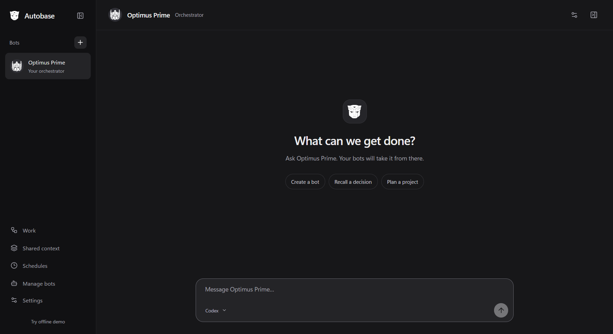

# Autobase

A Grok Bot-inspired desktop harness that lets frontier models create bots, delegate tasks and share context. I made it to use with my own Codex and Claude subscriptions.

## Download

1. [Download for Windows](https://github.com/mahojo99/autobase/releases/latest/download/Autobase-windows-x64.zip).
2. Unzip and open `Autobase.exe`.
3. Open Settings and sign in with Codex or Claude Code.

Windows x64. Requires the [Codex CLI](https://github.com/openai/codex) or [Claude Code](https://code.claude.com/docs/en/setup) installed.

[Development](docs/development.md)
