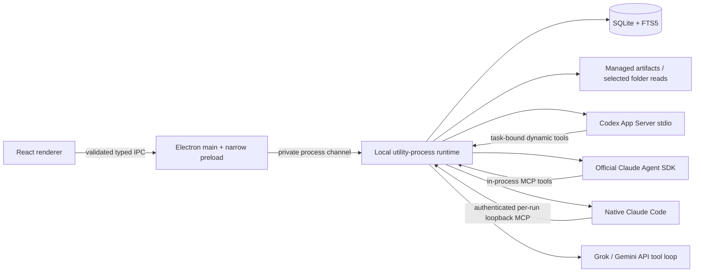

# Autobase architecture

Autobase is an independent, local Electron application. Its default interaction is a persistent conversation with Optimus Prime. Bots, assignments, results, and shared context are real runtime records; the interface is not a provider-chat mockup.

The owner renamed the product from Relay to Autobase and requested a simpler dark interface. The bot list is the main navigation; task details are closed by default, helper assignments expand from one inline summary, and artifacts remain directly accessible in chat. Optimus Prime is the orchestrator. New specialists receive an unused name from Bumblebee, Ratchet, Wheeljack, Arcee and Jazz, randomly and transactionally in the runtime. An explicitly requested available roster name is honored. Names are independent of roles; a fresh workspace has no specialists. Corresponding monochrome character portraits use owner-supplied Bumblebee artwork and five generated interpretations; [asset provenance](../src/ui/assets/bots/README.md) records the source and prompts.

The current roster permits five active specialists. Archival frees a name without changing historical bot IDs. Duplicate active names, colliding reactivation, and renaming the orchestrator are rejected. Tool receipts make repeated creation calls return the original identity. Existing legacy custom names remain readable with initials.

SQLite migration 2 renames only the original `Relay` orchestrator to `Optimus Prime`, once. Custom names, stable bot IDs, messages, and frozen run snapshots are retained. The application explicitly retains `%APPDATA%\Relay`, `relay.sqlite`, the `RELAY_*` environment overrides, and internal `relay_*` tool/IPC names so the visual rename does not create a second workspace or break integrations.

## Process and authority boundary

The renderer has no Node integration, is sandboxed, uses context isolation, loads a restricted `relay://app` origin, and receives no credentials. Main validates the sender frame and every command schema. Navigation, popups, webviews, and renderer permission requests are denied. Markdown renders without raw HTML; remote images are omitted and HTTPS links open through a narrow main-process handler. The only folder picker and encrypted credential store live in main.

The utility process owns scheduling, task identity, authorization, queue claims, provider execution, and SQLite. Native Claude's MCP endpoint binds only to `127.0.0.1` on a random port, requires a random per-run bearer capability, validates Host, rejects Origin, bounds requests, and closes on cancellation/completion. The capability is never sent to the renderer or transcript. Provider calls receive closures bound to one task/run; no tool accepts a caller-controlled workspace or acting-bot identity. Helpers cannot grant permissions, edit the orchestrator, approve actions, or delegate recursively. A child receives the intersection of parent and bot permissions. Selected-folder access is frozen on the run, so changing the selected folder cannot silently redirect an active task.

Default limits are two active execution slots, up to two helpers, depth one, 300 seconds, and 40 tool calls. A waiting parent releases an execution slot; the total number of owned sessions is bounded to concurrency plus one. Conversations are serialized per bot. Requests exceeding limits fail visibly. No task success is inferred from process exit or text alone: `relay_finish` must report an outcome, or a fixture adapter must explicitly supply one. Pending children prevent completion. Failed children must be acknowledged in the structured result.

## Durable data and recovery

`Store` uses Node's built-in `node:sqlite` (`DatabaseSync`), WAL mode, foreign keys, `BEGIN IMMEDIATE`, and nested savepoints. This avoids an external native SQLite addon while using an actual on-disk SQLite database. Electron 44.3.0 embeds Node 24.20.0, and the packaged utility process has been tested with it.

Migration 1 separates bots, conversations, messages, tasks, runs, events, decisions, artifacts, context, schedules, occurrences, settings, and tool receipts. Queue claims are transactional; a second connection cannot claim an already-claimed task. Retry creates a new attempt and retains the previous snapshot and terminal state. Bot edits affect future attempts; archives preserve historical ownership.

Runtime restart marks unresolved running/waiting work interrupted, expires provider-bound decisions, and cancels queued descendants of interrupted parents. It never automatically replays an uncertain side effect. The owner can inspect the timeline and explicitly retry. Ordinary queued root work remains eligible. Closing the app stops the runtime; there is no hidden tray service or always-on server.

Cancellation changes task state first, recursively cancels owned descendants, expires pending cards, and aborts execution. Codex receives `turn/interrupt`, then its owned stdio process is closed; the SDK receives cancellation and cleanup. No process-name-wide Windows kill is used. Late output cannot turn a cancelled task into success.

Events have monotonic database sequence numbers. The UI reconnects by loading a durable snapshot; text checkpoints are batched at roughly 350 ms, while live updates use a private push channel. Timeline entries are bounded in size and retained up to 10,000 events per workspace; snapshots display the latest 600. A crash can lose the final subsecond text delta, but not the last persisted task/attempt records. Provider sessions are not resumed after an uncertain crash.

## Engines and sessions

Codex uses the installed native executable and App Server 0.153.4 over JSONL stdio. `initialize` negotiates `experimentalApi`; `thread/start` registers validated dynamic functions; `item/tool/call` dispatches them into Autobase. Native ChatGPT authentication remains owned by Codex. Autobase neither reads nor copies login tokens and does not use ambient paid OpenAI API keys. `model/list` supplies the visible catalog. Other CLI versions produce an actionable readiness error until the adapter boundary is verified.

App Server and dynamic tool registration are experimental. The integration was checked against the installed CLI-generated TypeScript schemas, not invented SDK methods. Native shell, autonomous subagents, plugins, apps, memories, browser/computer tools, hooks, and discovered host skills are disabled; inherited MCP servers are disabled per run. The tool host remains enabled because dynamic functions require it. Native command/file approvals are denied; bounded Autobase tools handle reads and artifact creation.

Claude uses official `@anthropic-ai/claude-agent-sdk` 0.3.266, `query`, `tool`, and `createSdkMcpServer`. Built-in tools and filesystem settings are disabled. Only Autobase MCP tools are registered. A separate app-owned SDK configuration directory and allowlisted subprocess environment prevent reuse of subscription login/configuration. An explicitly supplied API key is encrypted by Electron `safeStorage` (Windows DPAPI). API billing is disclosed at entry. Claude models are explicit editable IDs, not a fabricated catalog. Readiness distinguishes missing credentials from a configured but not yet live-verified engine.

Every run starts a fresh compatible provider session with a visible handoff containing selected context, a compact workspace overview, recent indexed conversation, and prior-attempt output where appropriate. The visible conversation persists, but native provider sessions are never presented as portable across engines. This is a deliberate continuity design, at the cost of fresh-session prompt overhead. The build and live checks used `gpt-6-astra` with `xhigh`; new workspace model choice remains the provider default, editable by the owner.

## Context, files, and decisions

### Additional provider boundaries

The native Claude Code adapter runs the installed unmodified CLI (tested 2.1.263) with `stream-json`, restricted mode, empty built-in tools and setting sources, no hooks/plugins/memory, strict per-run MCP configuration, and a sanitized environment. Initialization fails if any unexpected tool is exposed or Autobase MCP is disconnected. Authentication stays in Claude Code's own account flow and credential store; Autobase reads only status metadata and never copies tokens. CLI dollar estimates are omitted because they are not subscription charges. Cancellation kills only the owned process and revokes its MCP capability. The temporary capability file is removed after execution.

Grok and Gemini use their documented Chat Completions compatibility APIs with fixed HTTPS endpoints, redirect rejection, explicit API key/model, a bounded request/response loop, and only runtime function tools. This adds two API adapters without adopting their native CLI tool permissions. No ambient API keys or fallback credentials are used. Runtime permissions, receipts, approvals and structured completion apply identically. Gemini assistant messages retain opaque tool-call signatures in run-local memory for the next API turn. They are not shown as reasoning or stored in conversation history. Usage sums provider token counts; no cost estimate is invented. Responses arrive one completed provider turn at a time. No automatic HTTP retry, model catalog, custom endpoint, or native Grok/Gemini login is shipped.

Settings exposes native Codex/Claude sign-in and separately encrypted API-key fields. Main accepts only fixed provider enums, owns CLI launch and Windows DPAPI storage, and never returns saved keys to the renderer. Browser sign-in must be completed by the owner; the new button's full OAuth interaction is not automated in tests. Existing native authentication was used for live verification.

The original API-only Claude brief is superseded by the owner's subscription request and the current [native-hosting documentation](https://code.claude.com/docs/en/legal-and-compliance). Its separate SDK adapter still uses API authentication. Provider limits and terms remain applicable.

### Workspace records

FTS5 indexes messages, results, artifact text, and typed memory with source IDs, timestamps, authority, exclusion, and supersession metadata. Separate physical databases enforce Personal/Demo separation, including guessed-ID reads. User decisions and preferences differ from agent facts/hypotheses. Corrections to confirmed memory create superseding records, preserving conflicting historical sources. Exclusion removes searchable content and excluded messages from future handoffs. Deleting a task source also removes its associated source messages, result files, derived index entries, and retained textual run content. This is application-level deletion, not a forensic secure-erasure guarantee or deletion of provider-side records.

Selected-folder reads resolve canonical paths and reject traversal, hidden/credential paths, binary data, oversized files, and junctions escaping the selected root. Artifacts are app-created UTF-8 files with registered metadata, byte counts, and SHA-256 hashes. Opening checks the canonical path and content hash. Arbitrary renderer paths, executables, and HTML artifact types are rejected. Common credential formats are redacted at durable-storage and tool-output boundaries; credentials belong in the encrypted settings flow.

Public-page retrieval is a bounded HTTPS text reader, not a full browser. It rejects private/reserved addresses, pins validated IPv4 DNS results, limits response size and duration, and refuses cross-origin redirects. Without general web scope, a pending card binds one exact URL/action/run to a one-time decision. A changed fingerprint, old run, expired card, unsupported answer, or cancelled task cannot grant access. Approval decisions and denials are retained; an engine cannot approve itself.

## Local schedules

One-off, daily, and weekday schedules use IANA timezones through Luxon. Each due occurrence has a durable unique identity. Downtime coalesces to one catch-up assignment; an existing active occurrence prevents overlap. Spring DST gaps shift forward using Luxon's valid wall time; fall folds choose the earlier occurrence and run once. Disabled one-off schedules in the past require a new occurrence. Schedule times remain tied to their named timezone when the host timezone changes.

## Optional computer boundary

The delivered app probes Podman availability and machine state and presents an honest unavailable/setup state. On this host Podman and Docker are absent. WSL reports an Ubuntu 22.04 default distribution using WSL 2; this does not establish a working Podman machine or guest desktop. No virtualization prerequisite was installed, no guest image was downloaded, and no VM was represented by a prerecorded screenshot.

Computer create/start/stop/delete, streamed guest desktop, and guest browser automation are not shipped in this build. Completing them requires an intentionally provisioned, app-owned local computer backend and real lifecycle/browser verification. Normal orchestration is independent of that optional milestone. The host provider process is not itself a VM sandbox.

## Deliberate release limitations

- Retries are explicit at the task level. Authentication failures and denial never loop. Native provider transient retry behavior is bounded by the run timeout; Autobase does not retry uncertain tools automatically.
- No arbitrary shell commands, host desktop control, imported MCP-server configuration UI, vector database, tray service, or external notifications.
- No automatic restoration of native provider sessions after restart; handoff-based continuity is tested instead.
- The Windows deliverable is a portable, unsigned application directory, not an installer or published release.

Primary references: [Codex App Server](https://learn.chatgpt.com/docs/app-server), [Claude Agent SDK](https://code.claude.com/docs/en/agent-sdk/overview), [SDK TypeScript reference](https://code.claude.com/docs/en/agent-sdk/typescript), [Electron security](https://www.electronjs.org/docs/latest/tutorial/security), [Electron utility process](https://www.electronjs.org/docs/latest/api/utility-process), [Podman on Windows](https://podman-desktop.io/docs/installation/windows-install). OpenMausBot supplied general product inspiration from the owner's brief; no code or branding was copied.
